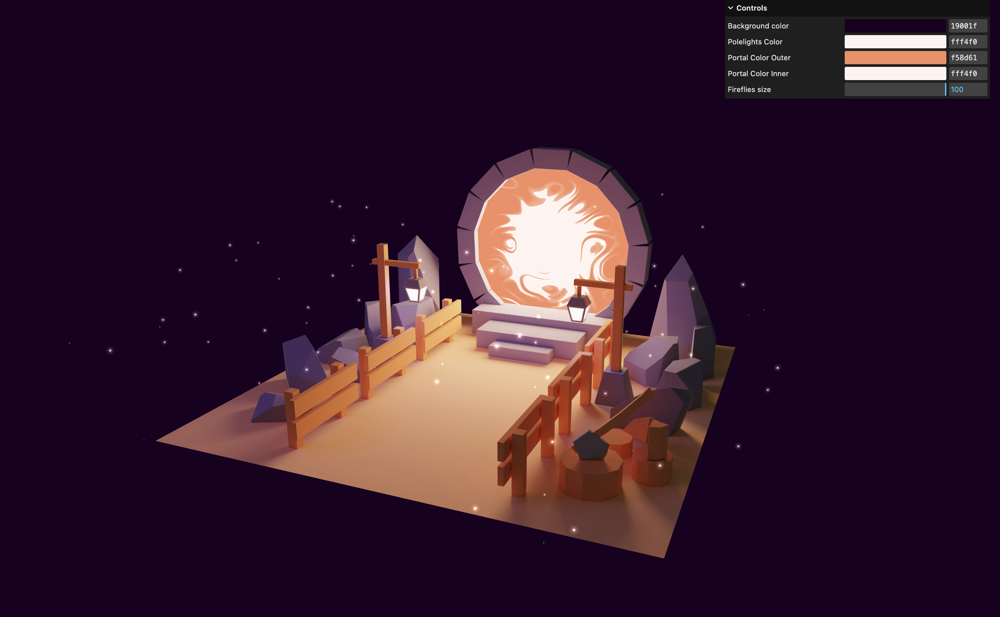

# BLENDER PORTAL

A portal made with blender and threejs. [live demo](https://babakoto-portal.vercel.app/)

Exercice from [threejs-journey](https://threejs-journey.xyz/) by [Bruno Simon](https://github.com/brunosimon) to learn [three.js](https://threejs.org/)

